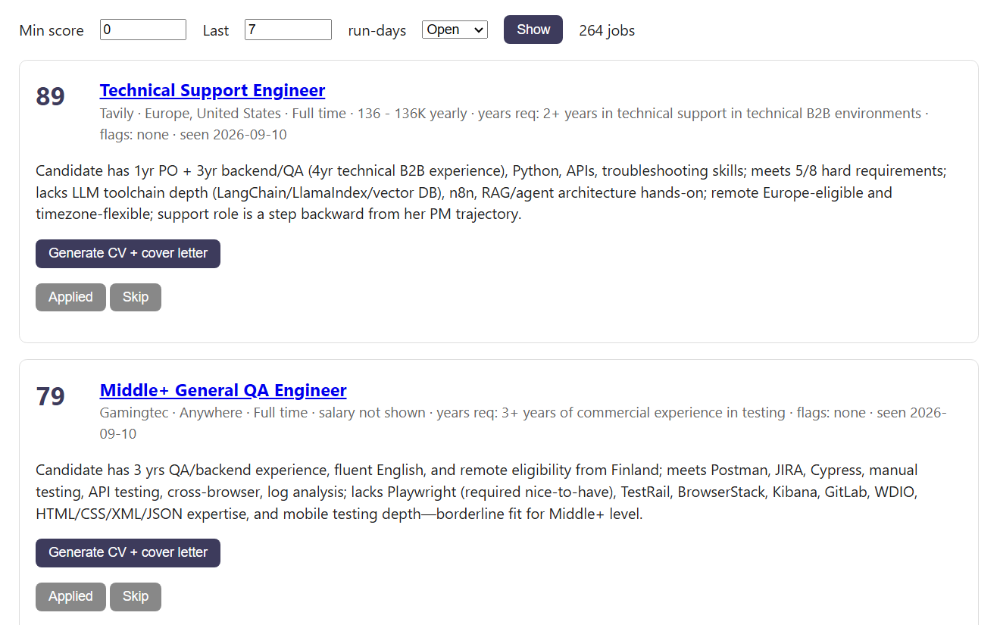

# job-radar

A personal job-search pipeline. It fetches remote-eligible listings from Jobgether, scores each one against my background with Claude, and gives me a small local web page where I review the ranked list, track what I've applied to, and draft a cover letter only for the jobs I actually want.



## Why I built it

Most listings on the boards I used were either not open to someone in Finland or not a real fit, and skimming them took hours. I wanted a ranked shortlist every morning and help with writing only where it was worth it.

## How it works

1. **Fetch.** `run.py` pulls listings from Jobgether by role and skill. Using `location=finland` returns roles open to Finland, Europe and "Anywhere", which is the set I want. Listings are stored in SQLite and anything already seen is skipped, so each run only adds new jobs.
2. **Extract.** Claude Haiku reads each posting and returns structured facts: years of experience required, which hard requirements I meet, whether I'm eligible to work remotely from Finland, salary if shown, and a set of red-flag fields.
3. **Score.** `compute_score()` turns those facts into a score from 0 to 100 using plain Python arithmetic.
4. **Review.** `serve.py` runs a Flask page at `localhost:5000`. I filter by minimum score and date, and mark each job as Applied or Skip so the list shrinks as I work through it.
5. **Draft.** For a single job, one click asks Claude Sonnet for a tailored CV profile paragraph and a cover letter. The output is a draft, not a finished application: I edit every letter before sending it.

## Design decisions

**The model extracts facts; Python does the scoring.** My first version asked the model for a score directly, and almost every job came back at around 72, which made the ranking useless. Now Haiku only answers factual questions about the posting and the score is calculated in code. The same facts always produce the same score, and I can change the weights without touching the prompt.

**Red flags are explicit rules.** After vetting a batch of high-scoring jobs by hand, I found stale postings, roles that required living in a specific US state, and products built for a single national market. Those checks are now rules in code: a residency restriction sets the score to 0, and a posting older than 180 days or a single-market product caps the score at 40. Each job shows which flags it triggered.

**A cheap model for every job, a stronger one on demand.** Haiku handles extraction for every listing. Sonnet is only called when I click Generate on a job I'm going to apply to.

**Known limit.** The posting date and company location come from the posting text only. Jobgether often leaves them out, so some stale listings still get through.

## Setup

```
pip install -r requirements.txt
copy .env.example .env                                    (then add your Anthropic API key)
copy prompts\score_cash.example.md prompts\score_cash.md
copy prompts\tailor.example.md prompts\tailor.md
copy prompts\candidate_facts.example.md prompts\candidate_facts.md
python run.py                                             fetch and score new listings
python serve.py                                           open http://127.0.0.1:5000
```

The `.example.md` prompts contain a made-up candidate. Replace the block in `prompts\candidate_facts.md` with your own background. `score_cash.md` and `tailor.md` both pull it in from there at runtime. Your copies are gitignored, so your personal details stay out of the repo.

## A note on fetching

Jobgether rejects plain Python HTTP clients, so fetching uses `curl_cffi` with a browser profile. I run this for personal use, once a day, with a delay between requests. If you reuse it, keep the volume low and respect the site's terms.

## Stack

Python, Flask, SQLite, curl_cffi, BeautifulSoup, Anthropic SDK (Claude Haiku and Sonnet).

Built AI-first: Claude wrote most of the code from my specifications. I made the design decisions, ran it daily against real listings, and fixed what didn't work.
